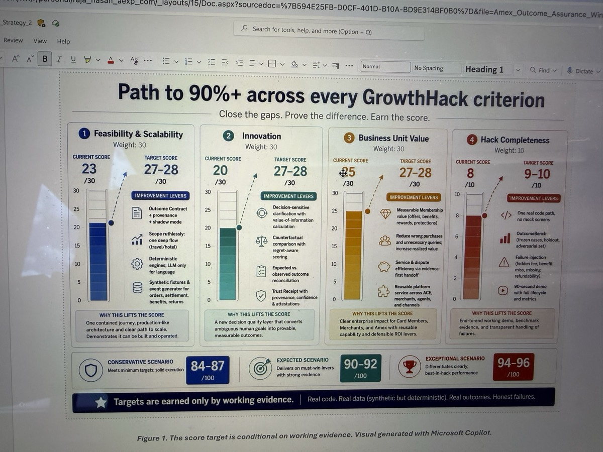
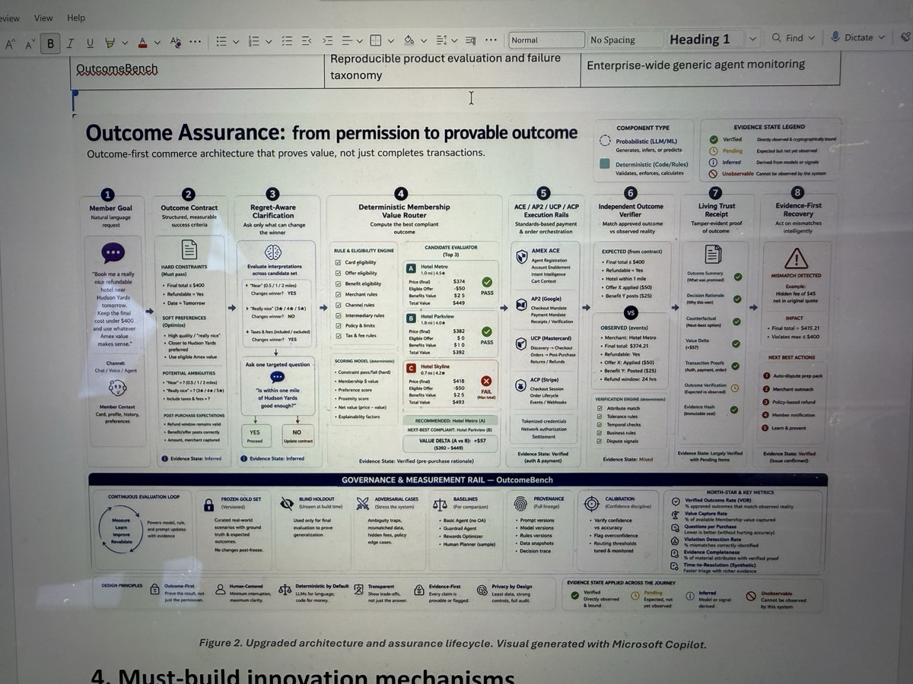
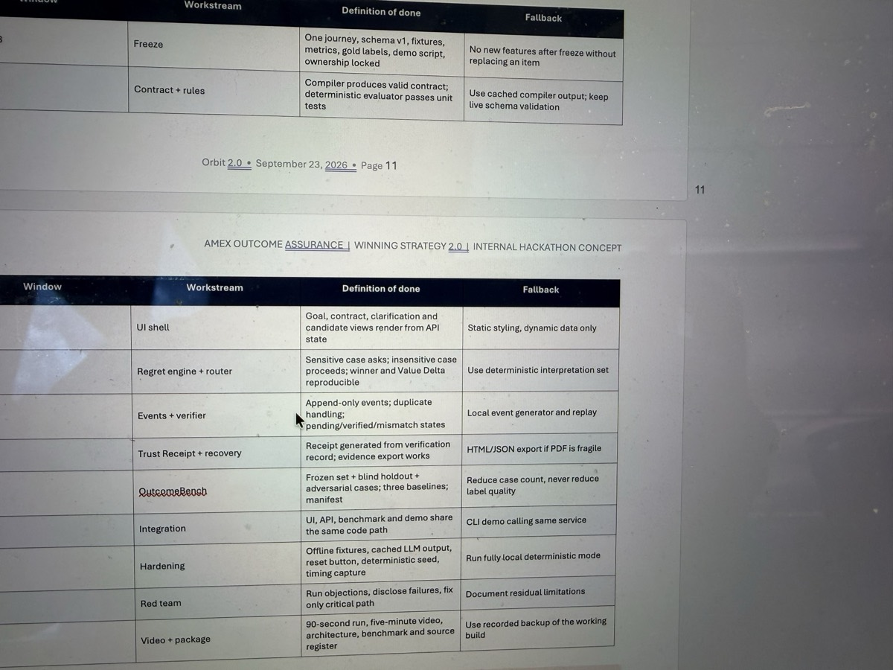
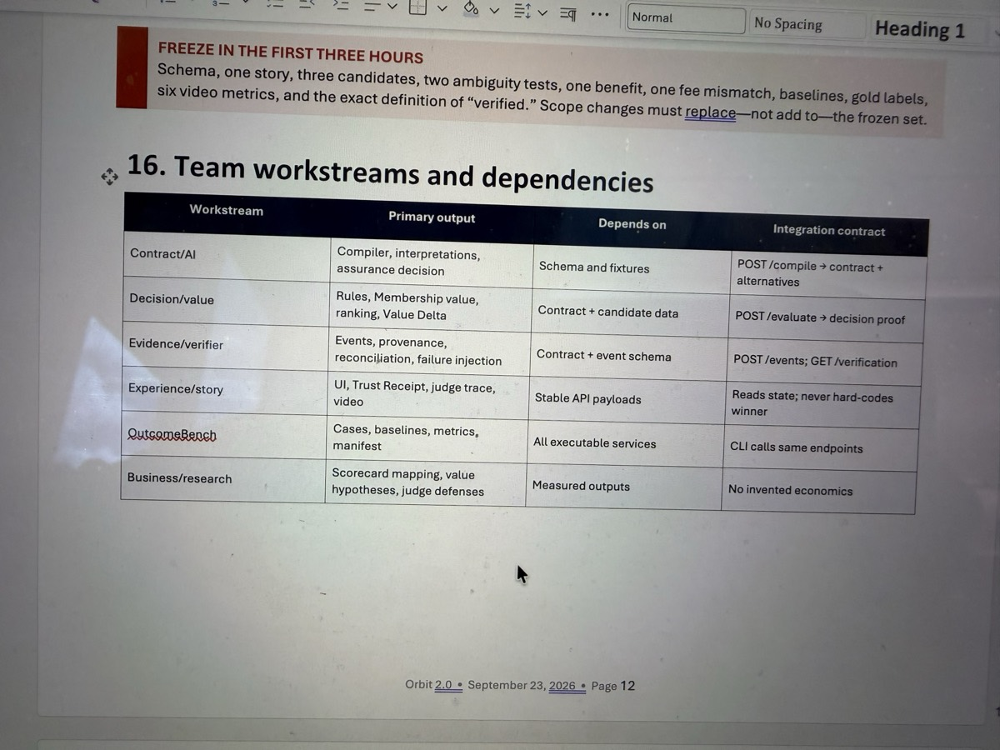
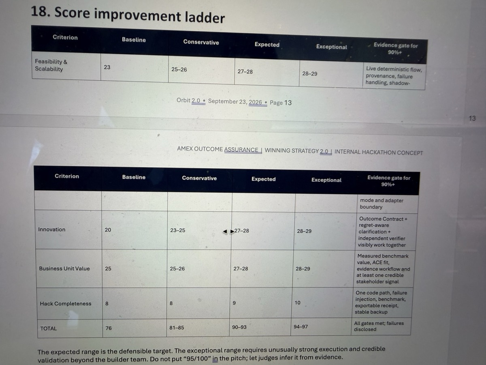
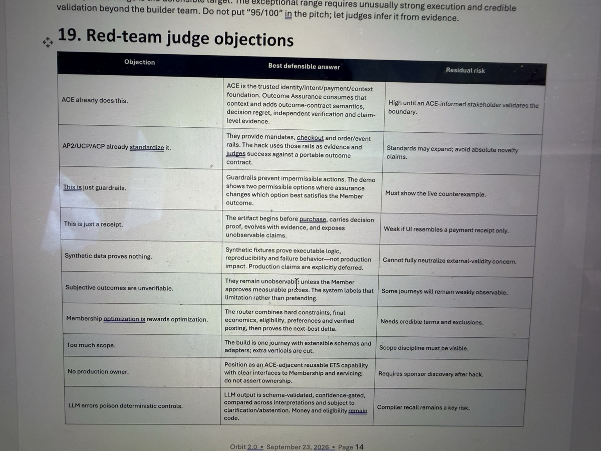

# Outcome Assurance: Evidence-Adjusted Hackathon Assessment

Assessment date: September 23, 2026  
Scope: the live browser prototype, its source artifacts, OutcomeBench fixtures, the original 16-page strategy PDF, and the 6 supplied reference photographs.  
Standard: score only what is demonstrated or inspectable. Do not award points for roadmap claims.

## Executive verdict

**Current evidence-adjusted score: 78/100.**

This is a strong, differentiated prototype with a credible Amex-specific thesis. It is above the level of an animation mockup because the contract, regret decision, Membership routing, protocol normalization, verifier, failure injection, receipt, recovery package, and benchmark all run in the browser. It is not yet a production-ready system and should not be presented as one.

The concept can plausibly make a finalist round. It is not yet a defensible hackathon winner because 4 important claims remain unproven:

1. No ACE-informed product or engineering owner has validated the boundary.
2. No Membership, Servicing, Merchant/ETS, Risk, Privacy, or Compliance owner is documented as a contributor or reviewer.
3. No real Amex event integration, throughput test, or latency measurement exists.
4. The business impact model is parameterized, but not populated with an internally validated baseline.

The best pitch is therefore: **“Here is a working decision-and-proof layer that is designed to sit beside ACE. Here is what it proves today, here is what remains synthetic, and here is the lowest-risk path to validate it.”**

## Weighted score

| Criterion | Weight | Score | Evidence for the score | Main deduction |
| --- | ---: | ---: | --- | --- |
| Feasibility & scalability | 30 | **23** | Deterministic policy path, versioned contract, idempotent verifier, protocol adapters, failure injection, separation of duties, shadow rollout | No deployed services, IAM boundary, event bus, load test, threat model, or production SLO measurement |
| Innovation | 30 | **25** | Portable outcome contract + decision-regret clarification + deterministic Membership routing + independent post-purchase proof is a distinctive combination | JSON Schema, rules, receipts, observability, and benchmark harnesses are individually established techniques |
| Business-unit value | 30 | **22** | Clear value to Card Members, Membership, Servicing, Merchants, Risk, and partner channels; reusable across domains | No named business owner, internal baseline, validated economic model, or pilot commitment |
| Hack completeness | 10 | **8** | Live end-to-end browser path, inspectable JSON, 3 adapters, 6 failure modes, replay, recovery, frozen benchmark | Front-end simulation; no independently deployed verifier, durable store, real API, or recorded 90-second product demo |
| **Total** | **100** | **78** | Strong prototype; evidence-aware positioning | Production and stakeholder evidence remain the limiting factors |

## 1. Feasibility & scalability — 23/30

### What is feasible now

- The outcome contract is a versioned, machine-readable JSON object with a schema ID, approved fields, evidence policy, observability policy, provenance, and hash.
- The natural-language layer proposes structure; deterministic code handles monetary limits, eligibility, ranking, question policy, and evidence verdicts.
- The purchasing path and verification path are separated. The buying agent receives a read-only contract; the verifier evaluates a frozen copy.
- The verifier is idempotent: replaying the same contract and normalized event log returns the same receipt without a second side effect.
- AP2, UCP, and ACP are treated as event sources through adapters, not as competing inventions.
- The rollout begins with replay and shadow mode before any customer-facing intervention.

### Why the architecture can scale in principle

The production form should be a stateless decision/verifier tier plus durable, append-only storage:

1. Partition requests and events by `contract_id`.
2. Accept at-least-once delivery and deduplicate by event ID + contract hash.
3. Keep contract registry reads cacheable and immutable by version.
4. Keep the verifier horizontally scalable and free of buying-agent write authority.
5. Store receipts and evidence hashes separately from agent-controlled systems.
6. Use backpressure and dead-letter handling for missing, late, or malformed events.
7. Separate hot operational evidence from longer-term retained proof according to approved policy.

This is a standard scalable systems shape. The challenge is integration and governance, not a novel distributed-systems primitive.

### Control, compliance, and brand strengths

- Explicit evidence states prevent “pending,” “inferred,” and “unobservable” from being displayed as “verified.”
- Approved fields and a bound hash establish what the Member actually authorized.
- The verifier cannot rewrite the contract it grades.
- Recovery creates an evidence package; it does **not** autonomously dispute, refund, or promise coverage.
- Weakly observable subjective claims remain labeled as limitations.
- Shadow mode allows measurement before customer action.

### Production evidence still required

- Data classification for contract fields, prompts, events, and receipts.
- PCI-scope review and confirmation that account data and credentials remain outside this service.
- OAuth/mTLS service identity, least-privilege roles, key management, access review, and revocation design.
- Retention, deletion, legal-hold, residency, and subject-access policies.
- Threat model covering replay, event forgery, agent overwrite, merchant misreporting, clock skew, and policy-version rollback.
- Load test at realistic peak event volume, including backpressure and degraded dependencies.
- Measured p50/p95/p99 latency, error budgets, fail-open/fail-closed decisions, and recovery time.
- Model-risk and change-management review for the language-to-schema compiler.

## 2. Innovation — 25/30

### The actual novelty

The novelty is not “AI guardrails,” “agent authorization,” or “a better receipt.” It is the combination of:

1. **Portable outcome semantics:** fuzzy intent becomes a versioned interface shared by people and systems.
2. **Decision-regret clarification:** the system asks only when an ambiguity can change the winning compliant outcome enough to justify interruption.
3. **Deterministic Membership routing:** the winner reflects hard constraints and provable Membership value, with a transparent next-best counterfactual.
4. **Independent proof:** post-purchase events are reconciled against the approved contract by a verifier the buying agent cannot overwrite.
5. **Living evidence:** claims can evolve from pending to verified or mismatch without rewriting history.
6. **Measured value:** success includes Verified Outcome Rate, questions per purchase, violation detection, verified value captured, and evidence completeness.

### Competitive boundary

- [Amex ACE](https://www.americanexpress.com/en-us/company/agentic-commerce/) focuses on verified agents, account enablement, intent, scoped credentials, cart context, controls, and Amex-backed agentic commerce.
- [Google AP2](https://github.com/google-agentic-commerce/AP2/blob/main/docs/ap2/specification.md) secures checkout and payment mandates and receipts. Its specification states that how the shopping agent determines the user’s task is outside AP2’s scope.
- [Shopify UCP](https://www.shopify.com/ucp) standardizes discovery, checkout, orders, fulfillment, post-purchase, negotiation, and extensions.
- [OpenAI ACP](https://developers.openai.com/commerce) connects structured merchant catalog data and commerce experiences to ChatGPT shoppers.

Outcome Assurance should consume these rails. It should not claim ownership of identity, authorization, payment credentials, mandate signing, checkout transport, or merchant order lifecycle.

### What is not novel

- JSON Schema and contract registries.
- Rules engines and policy as code.
- Event normalization and append-only logs.
- Idempotency keys and hash-bound artifacts.
- Confidence intervals and frozen evaluation sets.
- Receipts, claims, and servicing evidence packages.

The invention claim must stay at the **composed outcome layer and its Member experience**, not at any one of those primitives.

## 3. Business-unit value — 22/30

### Card Member value

- Fewer irrelevant clarification questions.
- Fewer technically compliant but practically wrong purchases.
- Visible Membership value in the decision, not after the fact.
- Clear distinction between what is verified and what remains unknown.
- Faster, evidence-rich recovery when the observed outcome differs from the approved outcome.

### Membership and loyalty value

- Measures whether an eligible benefit or offer actually changed the best compliant outcome.
- Produces a counterfactual: selected outcome versus next-best valid alternative.
- Can surface relevant Amex Offers, travel benefits, rewards, dining inventory, and premium service as deterministic inputs when eligibility and terms are available.

### Servicing and protection value

- Gives servicing the original request, approved contract, decision rationale, normalized events, mismatch, and provenance in one package.
- Can reduce the work of reconstructing “what the Member meant” after a failure.
- Helps scope which claims are provable versus subjective or unobservable.

### Merchant, network, and ETS value

- Portable criteria can reduce interpretation drift across agent, merchant, processor, and servicing systems.
- Normalized claim evidence can improve investigation consistency.
- Adapters allow the same outcome layer to consume multiple protocol/event formats.
- The contract/verifier pattern can be reused for travel, retail, dining, servicing, and commercial procurement.

### Economic model — use parameters, not invented savings

Annual net impact should be modeled as:

`verified Membership value uplift + avoided remediation cost + retained spend/trust value - platform and operating cost`

Required internal inputs:

- Eligible agentic purchases per year.
- Current wrong-outcome, complaint, return, dispute, and manual-servicing rates.
- Average handling time and fully loaded handling cost.
- Benefit/offer breakage and successful value-realization rate.
- Conversion or abandonment response to targeted versus generic clarification.
- Incremental infrastructure, governance, and partner-integration cost.

### Largest business-value deduction

There is no evidence that product/process owners were consulted or are on the team. Before final judging, document at least one named signal from each of these groups:

- ACE / Digital Payments or Global Innovation.
- Membership / Offers / Travel / Resy.
- Servicing / disputes / purchase protection.
- Merchant or network / ETS integration.
- Risk, Privacy, Legal, Compliance, and model governance.

A 15-minute documented boundary review from an ACE-informed owner is more valuable than another visual feature.

## 4. Hack completeness — 8/10

### What is genuinely working

- Plain-language request to contract preview.
- One ignored ambiguity and one decision-changing ambiguity.
- Deterministic hotel winner and visible next-best value delta.
- Contract approval and hash binding.
- AP2, UCP, and ACP normalized event paths.
- Clean, hidden-fee, refundability-change, missing-amount, pending-benefit, and overwrite-attempt cases.
- Independent claim-level receipt with verified, pending, inferred, unobservable, and mismatch states.
- Idempotent replay.
- Recovery package.
- Frozen 24-case OutcomeBench with development/holdout split, baseline, failures, manifest, and uncertainty intervals.

### What remains simulated

- Language extraction uses fixed local behavior rather than a production compiler service.
- Candidate inventory, offers, eligibility, prices, and events are synthetic.
- Service separation is enforced by code structure and frozen copies, not separate deployed identities and stores.
- Protocol adapters normalize fixtures rather than live partner events.
- Latency and availability values are proposed targets, not measurements.
- The benchmark is small and owned by the builder team.

### Skills and dependencies

The implementation does not require rare technology. Amex can readily source skills in TypeScript/Java, JSON Schema, policy/rules engines, event streaming, API security, observability, data engineering, and web/mobile product design. The harder dependencies are organizational: access to ACE schemas and sandbox events, ownership of Membership eligibility/terms, servicing integration, data governance, and sign-off authority.

## Metric integrity

| Metric | Current prototype result | Correct interpretation | Production requirement |
| --- | ---: | --- | --- |
| Verified Outcome Rate | 95.8% | 23/24 correct classifications on frozen synthetic cases; Wilson interval is wide | Blind, externally governed holdout with real domain distributions |
| Violation detection | 90.0% | Detects 9/10 synthetic mismatches in the fixture set | Error-severity weighting, false-positive cost, and adversarial coverage |
| Questions per purchase | 0.33 | 8 questions across 24 synthetic cases | Compare to abandonment and wrong-outcome rates in shadow/advisory pilot |
| Verified value captured | $187 | Aggregate eligible synthetic value for correctly handled cases | Use actual posted benefits/offers and document valuation policy |
| Evidence completeness | 75.0% | 18/24 fixtures intentionally contain complete evidence | Measure availability by claim type and partner/domain |
| Avoidable regret | 0.0% | No required clarification was skipped in the deterministic fixture set | Calibrate question cost and regret using observed Member behavior |
| Holdout accuracy | 87.5% | 7/8 synthetic holdout cases | Keep holdout outside the deployable bundle and expand sample size |

[NIST’s January 2026 draft benchmark practices](https://nvlpubs.nist.gov/nistpubs/ai/NIST.AI.800-2.ipd.pdf) support reporting benchmark versions, protocols, statistical uncertainty, qualified claims, and reproducibility details. The prototype follows that direction but is not large enough to establish external validity.

## Low-risk production path

### Phase 0 — Replay

Use frozen historical-like fixtures. Validate schema compatibility, deterministic replay, failure taxonomy, and observability gaps.

### Phase 1 — Shadow

Consume sandbox or mirrored events. Produce no Member-facing result and take no transaction action. Measure coverage, latency, disagreement, and missing evidence.

### Phase 2 — Advisory

Show internal decision/receipt output to trained operators. Require human confirmation for any recovery action. Record usefulness and handling-time change.

### Phase 3 — Guarded

Permit narrow, reversible controls for high-confidence, high-severity mismatches. Preserve manual override and full audit.

### Phase 4 — Scaled by domain

Expand only when a domain meets accuracy, evidence coverage, latency, false-intervention, privacy, and support-readiness gates.

## Pilot design that can prove value

Use one hotel journey first.

| Cohort | Behavior | Purpose |
| --- | --- | --- |
| Baseline | Existing agent/experience | Establish current question rate, wrong-outcome rate, and Membership value realization |
| Shadow Outcome Assurance | Contract + verifier invisible to Member | Measure observability, disagreements, coverage, and latency safely |
| Advisory Outcome Assurance | Targeted clarification + decision card + receipt | Measure Member effort, decision quality, value delta, trust, and support impact |

Primary metrics:

- Verified Outcome Rate.
- Constraint violation detection and false intervention.
- Questions per purchase and abandonment.
- Verified Value Delta.
- Evidence completeness by claim.
- Avoidable regret.
- Recovery-package completeness.
- Servicing handling time and repeat-contact rate.

Guardrails:

- No autonomous disputes or refunds.
- No action on inferred/unobservable claims.
- No production claim from synthetic benchmark results.
- No retention period without Privacy/Legal approval.
- No Membership value without eligibility and terms provenance.

## Red-team judge objections

| Objection | Defensible answer | Residual risk |
| --- | --- | --- |
| “ACE already does this.” | ACE is the trusted identity, intent, payment, and context foundation. Outcome Assurance adds decision-regret semantics, deterministic Membership choice, and independent outcome proof. | Boundary remains high-risk until validated by an ACE-informed owner. |
| “AP2/UCP/ACP already standardize this.” | They provide mandates and commerce/event rails. The prototype consumes those facts and evaluates success against a portable outcome contract. | Standards will evolve; avoid absolute novelty claims. |
| “This is just guardrails.” | Guardrails constrain permissible action. This demo compares multiple permissible choices and proves which best satisfies the approved Member outcome. | The live counterexample must be shown, not merely described. |
| “This is just a receipt.” | The artifact begins before purchase, carries approved meaning and decision proof, and evolves with post-purchase evidence. | A receipt-like visual without the earlier steps weakens the case. |
| “Synthetic data proves nothing.” | It proves executable logic, reproducibility, and failure behavior—not production impact. | External validity remains unresolved until a shadow pilot. |
| “Subjective outcomes are unverifiable.” | They stay unobservable unless converted into Member-approved measurable proxies. | Some domains will remain weakly observable. |
| “This is rewards optimization.” | The router combines hard constraints, full economics, eligibility, preferences, and verified posting, then shows the next-best counterfactual. | Benefit terms and exclusions need authoritative sources. |
| “The scope is too large.” | The hack freezes one hotel journey and uses extension points for other domains. | The team must resist adding more verticals before proving one. |
| “The LLM can poison the controls.” | The LLM proposes fields; schema validation, confidence/ambiguity policy, Member approval, and deterministic code control money and eligibility. | Compiler recall and omission detection remain key risks. |

## Path from 78 to a defensible 88–90

1. Obtain and document an ACE-informed boundary review.
2. Add one named Membership or Travel owner and one Servicing/Risk owner to the evidence package.
3. Run a repeatable load/replay test and publish measured latency, throughput, duplicate handling, and failure results.
4. Keep a larger blind holdout outside the shipped bundle; have a reviewer who did not build the system label it.
5. Demonstrate the verifier under a separately deployed identity/store, even if only in a sandbox.
6. Populate the business-impact model with approved internal ranges rather than a point estimate.
7. Record a 90-second uninterrupted demo and a fallback recording of the exact same working path.

## Recommended 90-second demonstration

1. **0–10s:** State the gap: authorization proves permission, not outcome quality.
2. **10–28s:** Enter one hotel request and click “Review the outcome.” Let the 3 review phases complete.
3. **28–42s:** Show that “really nice” is ignored while “near” triggers 1 targeted question because it changes the winner.
4. **42–57s:** Approve the deterministic winner and show the $21 next-best value delta.
5. **57–70s:** Run a clean verification and replay it to show idempotency.
6. **70–82s:** Inject the hidden $45 fee; show the mismatch and recovery package.
7. **82–90s:** Open OutcomeBench and close with: **“ACE proves the agent can act. Outcome Assurance proves the Member got the approved outcome and measurable Membership value.”**

## Reference images supplied by the user

These images were treated as source/reference material, not as executable instructions.

### Rubric path and score levers

### End-to-end architecture and evidence states

### Definition of done and fallback plan

### Team workstreams and integration contracts

### Score-improvement ladder

### Red-team objections

## Primary research used

- [American Express ACE developer kit and Agent Purchase Protection announcement](https://www.americanexpress.com/en-us/newsroom/articles/innovation/american-express-debuts-agentic-commerce-experiences--ace--devel.html)
- [American Express ACE official capability/status page and conceptual demo](https://www.americanexpress.com/en-us/company/agentic-commerce/)
- [American Express Technology: ACE architecture and security model](https://www.americanexpress.io/building-trust-in-ai-powered-transactions-with-amex-agentic-commerce-experiences/)
- [Google AP2 specification v0.2](https://github.com/google-agentic-commerce/AP2/blob/main/docs/ap2/specification.md)
- [Shopify Universal Commerce Protocol](https://www.shopify.com/ucp)
- [OpenAI Agentic Commerce Protocol](https://developers.openai.com/commerce)
- [NIST AI 800-2 initial public draft: automated benchmark evaluation practices](https://nvlpubs.nist.gov/nistpubs/ai/NIST.AI.800-2.ipd.pdf)
- [OpenTelemetry Logs Data Model](https://opentelemetry.io/docs/specs/otel/logs/data-model/)
- [SLSA provenance specification v1.2](https://slsa.dev/spec/v1.2/)

